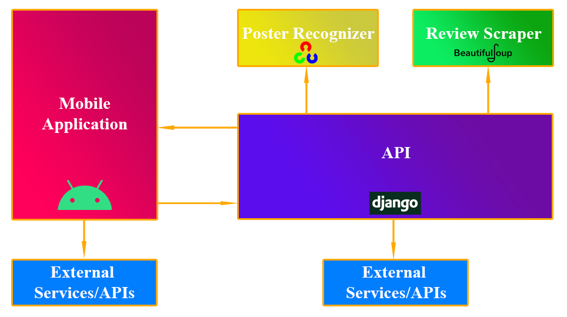
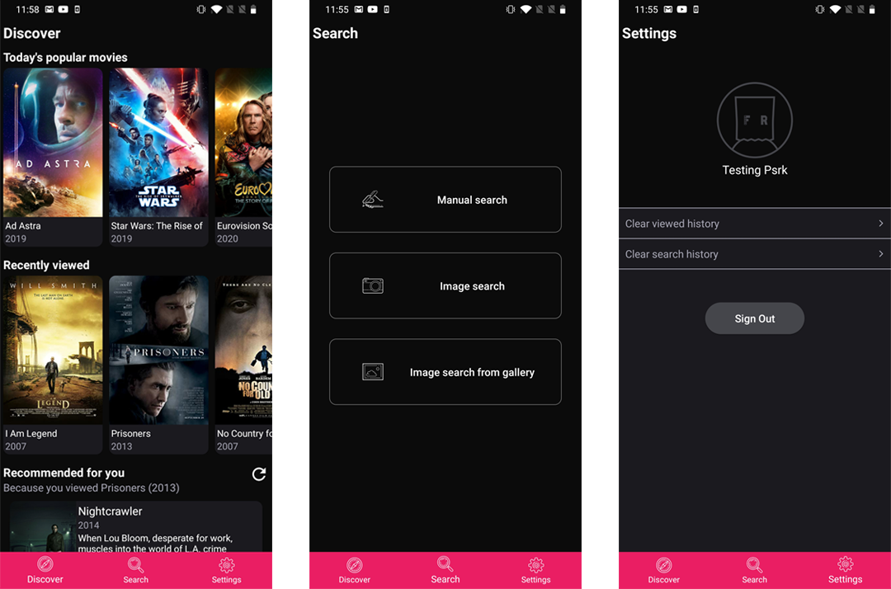
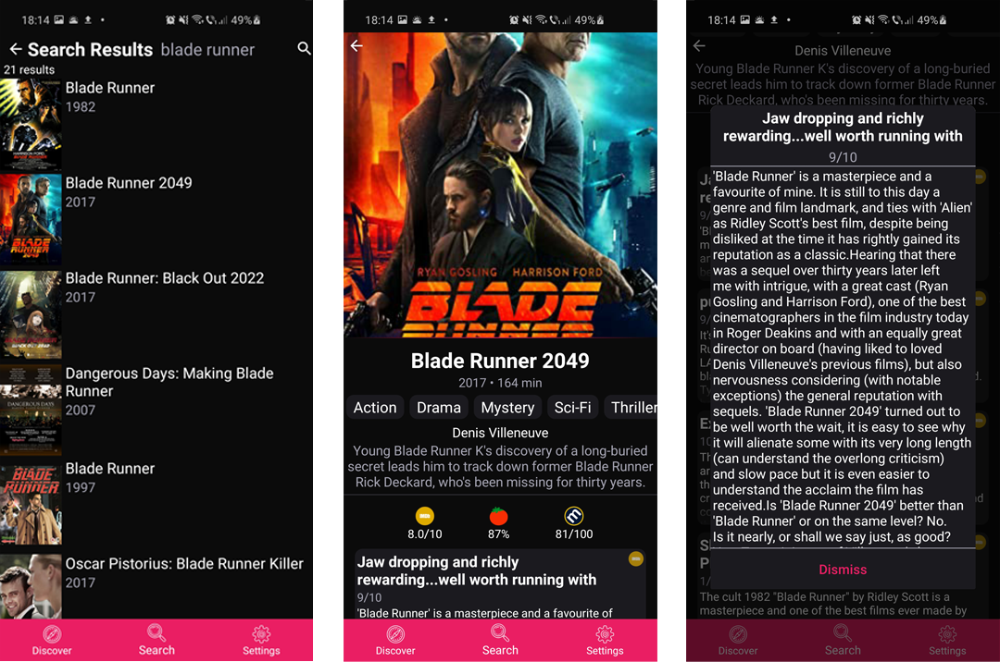

# FlickRank
Original repositories can be found on Gitlab:
* [Android Mobile Application](https://gitlab.com/PaulLinca/flickrank)
* [Django Backend](https://gitlab.com/PaulLinca/flickrankbackend)

   
 

FlickRank is an Android application that helps users choose what movie to watch by providing them with reviews gathered from numerous sources.

### Features
* Google authentication using **Firebase**
* Movie search:
  * Manual - type keywords in a search box
  * Image search - take a photo of the movie poster
* Retrieve moive revies from various sources using web scraping techniques
* Movie recommendation based on previously viewd movies
* Lists the day's popular movies

### Conceptual Architecture

   
 

**Components:**
* Mobile Application - **Android** app written in **Kotlin**
* API - Django application written in **Python**
* Poster Recognizer - **OpenCV** app written in **Python**
* Review Scraper - **BeautifulSoup** web scraper written in **Python**

### FlickRank Application
* **MVVM** Architecture
* **Retrofit** HTTP Client
* **Room** Persistence Library
* **Koin** Dependency Injection Framework
* **Android Jetpack** 
* **Glide**
* **Firebase**

### Tabs

   
 

### Search 

   
 

More info available in the documentation.
